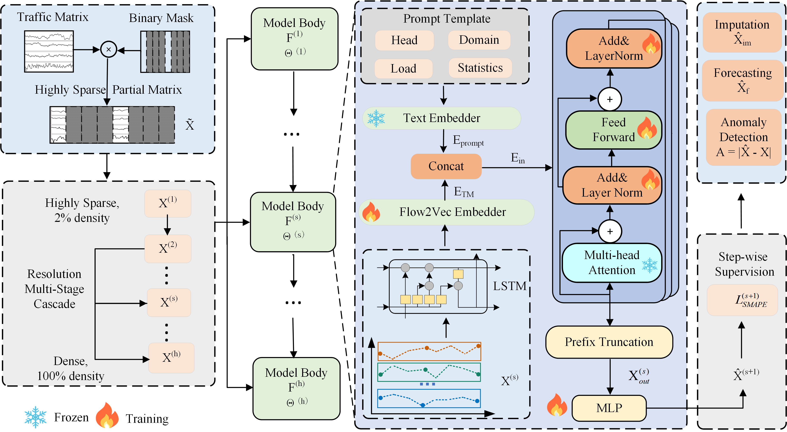

<div align="center">
  <h1><b> Trustworthy Traffic Analysis via Large Language Models</b></h1>
</div>

## Abstract

> The Traffic Matrix (TM) is vital for network management; however, its decentralized circulation faces strict regulatory and data sovereignty constraints, restricting raw data sharing and causing massive data missingness. Existing learning-based TM recovery methods lack trustworthiness: they either adopt a single-stage generation paradigm that lacks generalization ability, or suffer from cross-scale parameter interference and ignore multi-scale features. To build a secure and compliant data circulation infrastructure, we propose MPA-LLM, a trustworthy traffic analysis and reconstruction framework based on a Multi-Parameterized Autoregressive Large Language Model. Inspired by the coarse-to-fine human cognitive process, MPA-LLM deploys LLMs for incrementally refines the TM through a step-wise autoregressive mechanism. It also employs a decoupled resolution reconstruction framework to eliminate parameter interference, rendering TM recovery highly transparent, auditable, and reliable for multi-party collaboration. Furthermore, a dynamic on-demand mechanism maintains a unified multi-task framework and simultaneously supports high-precision TM imputation, forecasting, and anomaly detection tasks. Extensive experiments show that MPA-LLM significantly outperforms state-of-the-art methods on multiple TM analysis tasks. Furthermore, it maintains strong performance whether given only limited TM knowledge (e.g., 5%–10% TM snapshots) or no prior knowledge at all on unseen networks. 

## Introduction
The MPA-LLM framework. Traffic data are processed through a sequence of varying resolutions in a coarse-to-fine manner. The Multi-Head Attention layers and Text Embedder of the pre-trained LLM are kept frozen to preserve general language modeling capabilities, while the Flow2Vec Embedder, normalization layers, feed-forward layers, and the shared MLP projection head are fine-tuned to align latent representations with diverse downstream tasks.



## Requirements
Use python 3.10 from MiniConda

- absl-py==1.2.0
- einops==0.4.1
- h5py==3.7.0
- keopscore==2.1
- opt-einsum==3.3.0
- pytorch-wavelet
- PyWavelets==1.4.1
- scikit-image==0.19.3
- scikit-learn==1.0.2
- scipy==1.7.3
- statsmodels==0.13.2
- sympy==1.11.1
- torch==2.1.2
- transformers==4.46.0

To install all dependencies:
```bash
pip install -r requirements.txt
```

## Datasets
- Abilene dataset
- GÉANT dataset
- WS-DREAM dataset

These three public datasets are under `./dataset/net_traffic/Abilene`, `./dataset/net_traffic/GEANT` and `./dataset/net_traffic/wsdream`. Once the paper is accepted, we will make the dataset download link publicly available.

## LLM settings
`./Detection AND Imputation/models/MPA-LLM.py` and `./Forecasting/models/MPA-LLM.py` provide examples of using GPT2, deepseek_R1_1.5b, and llama_3.1_8b. Our experiments are based on these models. Please download the corresponding models from Hugging Face to the corresponding locations.

## How to Run the Model

We provide experiment scripts for all three tasks: **Imputation, Anomaly Detection, and Forecasting**. The scripts are organized into two corresponding directories.


### Part 1: Detection and Imputation

#### Option 1: Using the .py Script

Abilene Dataset Test:
```bash
python "./Detection AND Imputation/run_abilene.py"
```
GÉANT Dataset Test:
```bash
python "./Detection AND Imputation/run_geant.py"
```
WS-DREAM Dataset Test:
```bash
python "./Detection AND Imputation/run_wsdream.py"
```

#### Option 2: Using the .sh Script

Abilene Dataset Test:
```bash
bash "./Detection AND Imputation/scripts/Abilene.sh"
```
GÉANT Dataset Test:
```bash
bash "./Detection AND Imputation/scripts/GEANT.sh"
```
WS-DREAM Dataset Test:
```bash
bash "./Detection AND Imputation/scripts/wsdream.sh"
```

### Part 2: Forecasting

#### Option 1: Using the .py Script

Abilene Dataset Test:
```bash
python ./Forecasting/run_abilene.py
```
GÉANT Dataset Test:
```bash
python ./Forecasting/run_geant.py
```
WS-DREAM Dataset Test:
```bash
python ./Forecasting/run_wsdream.py
```

#### Option 2: Using the .sh Script

Abilene Dataset Test:
```bash
bash ./Forecasting/scripts/Abilene.sh
```
GÉANT Dataset Test:
```bash
bash ./Forecasting/scripts/GEANT.sh
```
WS-DREAM Dataset Test:
```bash
bash ./Forecasting/scripts/wsdream.sh
```


